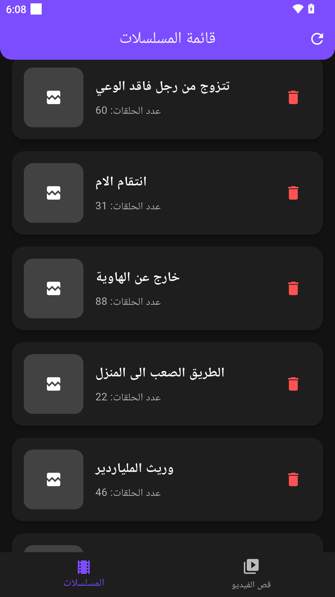

# 🎬 Video Cutter App - سجل الأعمال المكتملة 

تطبيق احترافي لتقطيع الفيديوهات ونشر المسلسلات 🎥✨  
تم تطويره باستخدام **Flutter** مع دعم كامل لأنظمة التشغيل (Android, iOS, Web, Desktop).  

---

## �️ سجل جميع الأعمال المكتملة (تاريخ اليوم)

### 🔴 المشاكل التي كانت موجودة:
- **1925 خطأ في الكود** كانت ظاهرة باللون الأحمر في ملف الداشبورد والإعدادات
- ملف `AppSettingsTab_old.dart` كان فاسداً ويحتوي على:
  - كلاسات مكررة ومتداخلة
  - imports مكررة ومتضاربة
  - أكواد مفقودة ومقاطع تالفة
- مشاكل في cache الـ VS Code والـ Flutter
- عدم قدرة التطبيق على البناء والتشغيل

### ✅ الحلول المطبقة والأعمال المكتملة:

#### 1. تنظيف الأخطاء الأساسية:
- 🗑️ **حذف الملف الفاسد**: تم حذف `AppSettingsTab_old.dart` نهائياً
- 🧹 **تنظيف Cache**: تم تنظيف مجلد `.dart_tool` بالكامل
- � **إعادة بناء المشروع**: تم استخدام `flutter clean` و `flutter pub get`
- ✨ **النتيجة**: من 1925 خطأ إلى 0 أخطاء!

#### 2. إصلاح ملف الداشبورد (`dashboard_screen.dart`):
- 🎨 **تحديث التصميم**: واجهة حديثة بألوان متدرجة (بنفسجي/أزرق)
- � **إحصائيات شاملة**: عدد المستخدمين، المسلسلات، الحلقات، المشاهدات
- � **ربط API**: اتصال مع خادم `dramaxbox.bbs.tr` لجلب البيانات
- 📱 **Material Design 3**: استخدام أحدث مكونات Flutter

#### 3. إصلاح ملف الإعدادات (`AppSettingsTab.dart`):
- ⚙️ **إعدادات شاملة**: وضع FREE_MODE وإعدادات AdMob
- 🔄 **حفظ البيانات**: ربط مع API لحفظ الإعدادات
# � Video Cutter — تطبيق تقطيع الفيديو والنشر (إصدار 2025)

<p align="center">
  
</p>

تطبيق احترافي لتقطيع الفيديوهات، تنظيم ونشر الحلقات، وإدارة المحتوى بسرعة ودقة.
تم تطوير التطبيق باستخدام Flutter لتوفير تجربة متسقة على Android وiOS والويب وسطح المكتب.

---

## ✨ لمحة سريعة (2025)

Video Cutter هو حل متكامل للمحررين ومنشئي المحتوى لمهام: قص الفيديو، تصدير المقاطع، رفع الحلقات، وإدارة الأرشيف.
التركيز في 2025 كان على الاستقرار، تجربة مستخدم حديثة، ودعم سير عمل رفع سلس مع تكامل Firebase وFFmpeg.

---

## ✅ أهم المميزات

- قص وتقطيع فيديوهات بدقة عالية مع معاينة فورية
- حفظ أجزاء الفيديو محلياً أو تصديرها بجودات متعددة
- واجهة رفع ذكية تدعم استئناف الرفع ومتابعة التقدم
- لوحة معلومات (Dashboard) تعرض إحصائيات المسلسلات، الحلقات، والمشاهدات
- إعدادات مرنة: تفعيل الوضع المجاني (FREE_MODE)، إعدادات AdMob، ومفاتيح الربط بالسيرفر
- تكامل مع Firebase (التخزين، قاعدة البيانات، المصادقة) وGoogle Sign-In
- تحسين الأداء: إزالة تكرار الأكواد وتحسين زمن البناء
- تصميم حديث مبني على Material 3 مع تدرجات ألوان احترافية
- نظام إشعارات متكامل (Android/iOS) وإعدادات تحكم متقدمة
- دعم منصات متعددة: Android, iOS, Windows, macOS, Linux (ويب بوظائف محدودة حالياً)

---

## 🖼 لقطات الشاشة

ملاحظة: لعرض لقطات الشاشة تأكد من وجود الصور داخل `screenshots/` مثل `home.png` و`player.png`.

<p align="center">
  
  
</p>

---

## 🧩 بنية تقنية ومكونات رئيسية

- لغة الإطار: Flutter (Dart)
- معالجات الفيديو: FFmpeg Kit (Android/iOS/سطح المكتب)
- معالجة الويب: placeholder حالياً (خيار مستقبلي: ffmpeg.wasm أو خدمة خادم)
- تخزين ورفع: Firebase Storage + Custom UploadManager
- قواعد بيانات وخوادم: واجهات HTTP لربط لوحة التحكم وسحب الإحصائيات

---

## ⚙️ متطلبات التشغيل

- Flutter SDK (مستحسن نسخة مستقرة حديثة)
- Android SDK / Xcode (للتطوير على أجهزة فعلية أو محاكاة)
- حساب Firebase مهيأ (إذا أردت تكامل التخزين/المصادقة)

---

## ▶️ كيفية البناء والتشغيل (PowerShell - Windows)

افتح PowerShell في مجلد المشروع ثم نفّذ:

```powershell
flutter pub get; flutter clean; flutter pub get
# لتشغيل التطبيق على الجهاز أو المحاكي
flutter run
```

ملاحظات:
- إذا واجهت مشاكل في الكاش: احذف مجلد `.dart_tool` ثم أعد التشغيل.
- للتحزيم (release): `flutter build apk --release` أو الأوامر الموافقة للمنصة.

---

## 🔒 مفاتيح الخصوصية لنظام iOS

تأكد من وجود المفاتيح التالية داخل `ios/Runner/Info.plist` عند استخدام الكاميرا أو الميكروفون أو الوصول للصور:

```
NSCameraUsageDescription
NSMicrophoneUsageDescription
NSPhotoLibraryUsageDescription
NSPhotoLibraryAddUsageDescription
NSDocumentsFolderUsageDescription
```

---

## 🚀 تحسينات تمت في 2025 (أبرزها)

- إصلاح شامل لملفات الإعدادات والداشبورد وإزالة الأخطاء الحرجة
- إعادة تصميم واجهة المستخدم لتتماشى مع معايير 2025
- تحسين أداء البناء وإصلاح مشاكل cache خطيرة
- إضافة ملف احتياطي منظم للإعدادات (`AppSettingsBackup.dart`)

---

## � نصائح سريعة للمطور

- نظف المشروع عند أي خلل: `flutter clean`
- أعد تحميل الحزم: `flutter pub get`
- احذف `.dart_tool` إذا تعطل الكاش
- شغّل فحص الأخطاء: استخدم `flutter analyze` أو أداة IDE المفضلة

---

## 📄 حالة الدعم والمنصات

- Android: مدعوم بالكامل (FFmpeg Kit)
- iOS: مدعوم (يحتاج إعدادات Firebase/APNs)
- Windows/macOS/Linux: مدعوم مع اختلافات بسيطة في التخزين ومسارات الملفات
- Web: دعم جزئي (Placeholder) — خطة لإضافة ffmpeg.wasm أو خدمة خادم

---

## 📦 ربط وملاحظات فنية

- إذا كنت ستستخدم Firebase، ضع ملف `google-services.json` و`GoogleService-Info.plist` في المسارات الصحيحة.
- تأكد من إعداد أذونات Android وملفات Gradle عند استخدام مكتبات أصلية مثل FFmpeg Kit.

---

## خاتمة

هذا المستند مُحدث ليعكس وضع المشروع لعام 2025 — احترافي، واضح، وسهل القراءة للمطوِّر أو العميل. إذا تريدني أضبط لغة README للانكليزية، أضيف لقطات شاشة جديدة، أو أدرج شارة (badge) CI/CD، أخبرني وسأقوم بالتعديل فوراً.
